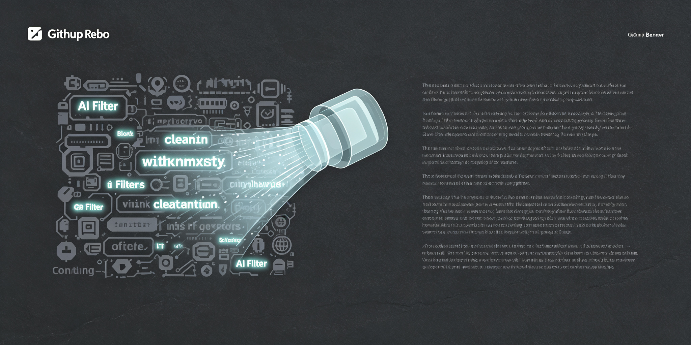

<div align="center">




# humanizer-zh

**给 AI 写的中文文本做"去AI味"手术——删掉拐杖词、打破三段式、让它读起来像人写的。**

<p>
  <a href="#"></a>
  <a href="#"></a>
  <a href="#"></a>
</p>

[为什么做](#为什么做) · [效果对比](#效果对比) · [检测模式](#检测模式) · [快速使用](#快速使用) · [质量评分](#质量评分)

</div>

---

## 为什么做

AI 写的中文有一股统一的"味"：

- 每段开头必带"此外/然而/因此"
- 凡事凑三点，少一点不自在
- "至关重要""深入探讨""赋能"满天飞
- 结尾必来一句"希望这对您有帮助"

你读着觉得哪里不对，但说不出来。这个 Skill 把"哪里不对"拆成 20+ 条可机械识别的规则，让 AI 自己把自己的味去掉。

## 效果对比

**AI 原味：**
> 此外，它提供了无缝、直观和强大的用户体验。这不仅仅是一次更新，而是我们思考生产力方式的革命。行业专家认为这将对整个行业产生持久影响。

**去味后：**
> 更新添加了批处理、键盘快捷键和离线模式。测试用户的早期反馈是积极的，大多数报告任务完成速度更快。

| 维度 | AI 原味 | 去味后 |
|------|---------|--------|
| 开头 | "此外/然而/因此" | 直接说事 |
| 结构 | 三段式凑齐 | 两项也可以 |
| 用词 | "至关重要""赋能" | 具体动词 |
| 结尾 | "希望有帮助" | 说完就停 |

## 检测模式

### 语言
- 过度连接词：此外、然而、因此
- 否定排比："不仅…而且…"
- 系动词回避：用"作为/标志着/代表着"代替"是"
- AI高频词：至关重要、深入探讨、持久的、增强、培养

### 内容
- 夸大象征："这标志着…""是…的体现"
- 宣传腔："令人叹为观止""充满活力"
- 模糊归因："专家认为""行业报告显示"
- 虚假范围："从X到Y"结构

### 风格
- 破折号过度使用
- 粗体满屏
- 粗体+冒号的标题式列表

### 交流痕迹
- 协作客套："希望这对您有帮助！""当然！"
- 知识截止免责："截至…""根据我最后的训练"
- 谄媚语气

## 快速使用

把这段发给你的 AI：

```
请使用 humanizer-zh 规则改写以下文本，
按"检测模式"逐条排查，重写后输出。

文本：<粘贴你的文本>
```

## 质量评分

改写完后让 AI 给自己打分（1-10分/项）：

| 维度 | 标准 |
|------|------|
| 直接性 | 直截了当 vs 充满铺垫 |
| 节奏 | 长短交错 vs 机械重复 |
| 信任度 | 简洁 vs 过度解释 |
| 真实性 | 自然流畅 vs 机械生硬 |

45-50 分优秀，35-44 良好，<35 重写。

## License

MIT
